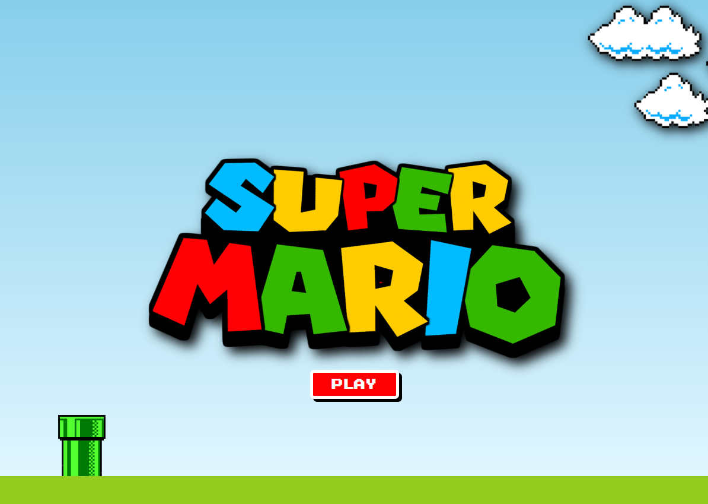

# Projeto Jogo do Mário

Este projeto é um jogo do Mário desenvolvido com HTML, CSS e JavaScript e adaptado para React Native.



## Pré-requisitos

- Node.js e npm
- React Native CLI
- Emulador Android ou iOS ou dispositivo físico

## Passos para Execução

1. **Desenvolvimento do Jogo**: Segui as instruções do vídeo [https://www.youtube.com/watch?v=r9buAwVBDhA](https://www.youtube.com/watch?v=r9buAwVBDhA), para criar o jogo do Mário usando HTML, CSS e JavaScript.
2. **Criação do Projeto React Native**: Crie um novo projeto React Native com o comando `npx react-native init NomeDoProjeto`.
3. **Instalação do WebView**: Instalei o WebView com `npm install react-native-webview`.
4. **Criação do Componente WebView**: Criei um novo componente que renderiza o jogo dentro de um WebView. O código pode ser parecido com isto:

```jsx
import React from 'react';
import { WebView } from 'react-native-webview';

export default function App() {
  return (
    <WebView source={{ uri: 'caminho/para/seu/jogo.html' }} />
  );
}
```


5. **Teste do Aplicativo** : Usei um emulador  e o dispositivo físico para testar o aplicativo.
6. **Construção do Aplicativo** : Construi o aplicativo para produção usando `npx react-native run-android --variant=release` para Android e `npx react-native run-ios --configuration=release` para iOS.

## Solução de Problemas

Se você encontrar algum problema ao executar o projeto, verifique se o React Native CLI está instalado corretamente e se o projeto foi inicializado corretamente como um projeto React Native. Você também pode tentar limpar o cache do npm ou excluir a pasta node_modules e reinstalar as dependências. Como fiz no início, pois encontrei alguns problemas relativos as versõs do React Native.


## Contribuições

Contribuições são bem-vindas! Por favor, leia as diretrizes de contribuição antes de enviar uma pull request.


## Licença

Este projeto está licenciado sob a licença MIT.
